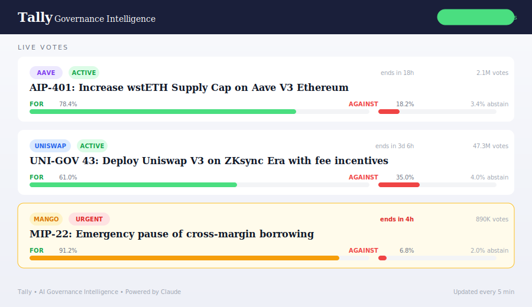
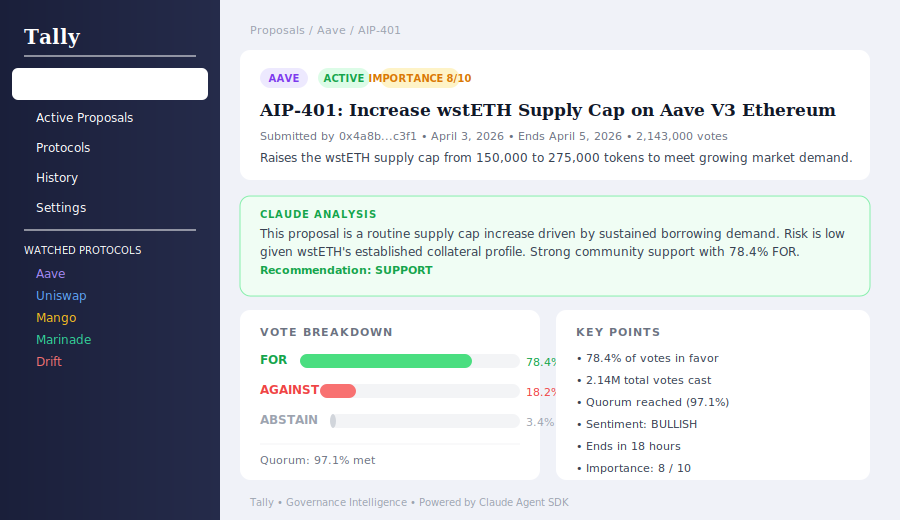

<div align="center">

# Tally

**Governance signal board for Solana and DeFi proposals.**
Tally watches Snapshot and Realms, builds readable governance digests from proposal text and metadata, and ranks proposals by how much they actually matter to token holders.

[](https://github.com/TallyGov/Tally/actions)

[](https://docs.anthropic.com/en/docs/agents-and-tools/claude-agent-sdk)

</div>

---

Governance is one of the few places where a token can change dramatically while the market is barely paying attention. Treasury policy, tokenomics shifts, voting power changes, and emergency proposals often move faster than most holders realize.

Tally is built to close that gap. It tracks active proposals, scores them by importance, and turns governance-speak into a digest a normal operator can scan in one pass.

`FETCH -> SCORE -> SUMMARIZE -> CLASSIFY -> DIGEST`

---

Live Vote Dashboard • Proposal Detail • Why Tally Exists • At a Glance • Governance States • What Makes A Proposal Important • Reader Workflow • Example Output • Importance Model • Risk Controls • Quick Start

## Live Vote Dashboard



## Proposal Detail



## Why Tally Exists

Most token holders do not ignore governance because they do not care. They ignore it because governance writing is slow to parse, full of internal language, and hard to rank.

That means the proposals with the biggest downstream impact often get treated like background noise until after they pass. Tally is meant to make that impossible to miss.

It is not a voting app and it is not trying to become a whole governance portal. It is a prioritization layer for people who want to know which proposals deserve attention now, which ones can wait, and what the proposal actually does in plain language.

## At a Glance

- `Use case`: tracking governance decisions across Solana and DeFi without reading every raw proposal
- `Primary input`: active proposals, venue metadata, proposal text, and importance scoring
- `Primary failure mode`: treating every proposal like it matters equally or missing the quiet ones that actually reshape the token
- `Best for`: holders, operators, and governance watchers who want a readable proposal board instead of a feed dump

## Governance States

| State | What it usually means | Typical behavior |
|-------|-----------------------|------------------|
| `watch` | proposal is real but not urgent yet | keep visible, monitor discussion |
| `important` | meaningful change to mechanics, treasury, or token structure | read now and decide positioning |
| `critical` | emergency, security, or high-impact proposal | immediate attention |
| `routine` | administrative or low-impact motion | digest later |

Tally is strongest when the state feels obvious after one glance.

## What Makes A Proposal Important

Not every proposal deserves the same level of energy. Tally should bring the important ones to the front for reasons that are easy to understand.

The board becomes useful when it highlights proposals that affect:

- treasury spending or asset movement
- tokenomics and emissions
- governance power and control
- core protocol parameters
- emergency or security response

This is where the repo becomes much more launchable than a plain "governance aggregator." The value is not aggregation alone. It is readable prioritization.

## Reader Workflow

Tally is built for a simple reading pattern:

### 1. Scan The Board

Find which venues and proposals are active right now.

### 2. Check Importance

Use the score to decide whether the proposal is routine, meaningful, or urgent.

### 3. Read The Digest

This is where the product earns its keep. The digest should explain the proposal in plain language and make the urgency obvious without forcing the reader through raw governance text.

### 4. Decide What To Do

Some proposals deserve immediate action, some deserve tracking, and some deserve almost none of your attention. Tally should make that difference obvious.

## How It Works

Tally follows a narrow governance loop:

1. fetch active proposals from Snapshot and Realms
2. normalize them into one comparable proposal surface
3. score each proposal for importance and urgency
4. build a readable digest from proposal text, timing, and vote structure
5. publish a board that lets operators sort signal from governance clutter

The value is not merely "all the proposals in one place." The value is knowing which ones matter before they become post-mortem discussion.

## What A Good Tally Summary Sounds Like

A good digest should not repeat the title with slightly cleaner words. It should explain:

- what changes if this passes
- who gains or loses influence
- whether the proposal changes token-holder reality in a meaningful way
- whether the operator should review now, keep it in watch mode, or safely leave it as low priority

That tone matters a lot for launch because most buyers are not governance specialists. They just need the proposal to become understandable fast.

## Example Output

```text
TALLY // PROPOSAL DIGEST

venue             Realms
proposal          Adjust staking emissions schedule
importance        8.4
state             important
recommendation    review now

summary: proposal changes reward pacing and could alter near-term token pressure.
```

## Importance Model

| Score | Meaning |
|-------|---------|
| `9-10` | emergency, security, or proposal with immediate protocol-wide consequences |
| `7-8` | high impact on tokenomics, treasury, or core mechanics |
| `5-6` | meaningful but not urgent |
| `1-4` | low-priority or mostly administrative |

The board gets better when those scores feel earned. Inflationary changes, treasury reallocations, and control shifts should obviously rank higher than routine housekeeping.

## Why Tally Is More Than A Feed Reader

- it turns governance text into readable language
- it ranks proposals by impact instead of posting everything flat
- it brings Snapshot and Realms into one board
- it helps normal holders notice the proposals that silently reshape token outcomes

That is a much stronger launch story than a simple aggregator.

## Risk Controls

- `importance scoring`: prevents routine proposals from burying urgent ones
- `digest summaries`: reduces the risk of unreadable governance jargon while preserving links to the source proposal
- `venue normalization`: makes cross-platform governance easier to compare
- `digest framing`: keeps the product focused on proposals that should alter attention and behavior

Tally should be judged on whether it makes governance easier to understand and harder to ignore.

## Quick Start

```bash
git clone https://github.com/TallyGov/Tally
cd Tally
bun install
cp .env.example .env
bun run dev
```

## License

MIT

---

*governance only looks boring until a proposal changes the token.*
